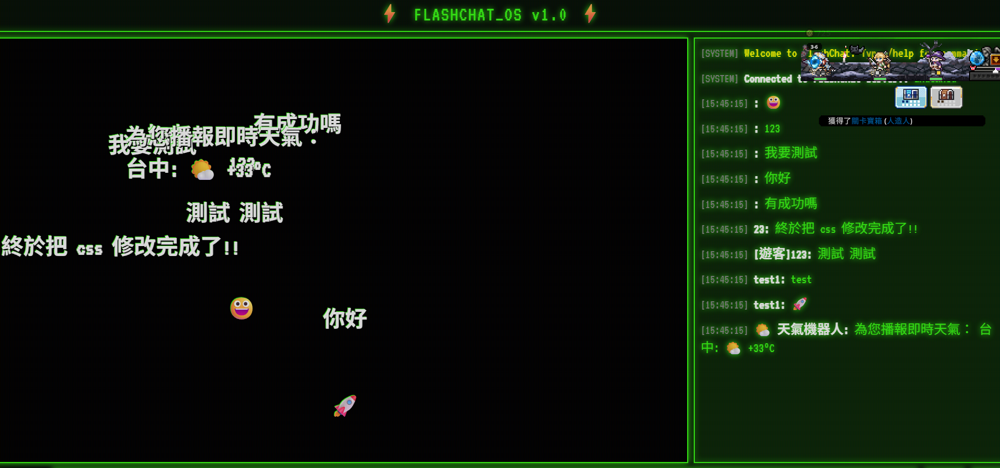

# ⚡ FlashChat-OS: Retro Terminal Chat System


> 基於 Go 語言與 WebSocket 打造的高併發、復古終端機風格即時通訊系統。導入 Clean Architecture、工廠模式與自動化 CI 測試流程，目的是學習現在後端技術。

### 📺 系統畫面展示 (Demo)
 

---

## 🚀 核心亮點功能 (Features)

* **🔐 雙軌身分驗證與安全機制**
  * 支援「正式會員註冊/登入」與「免密碼遊客模式」，嚴格區分身分權限。
  * 採用 **Bcrypt** 密碼雜湊加鹽儲存，並使用 **JWT (JSON Web Tokens)** 進行無狀態權限驗證與防篡改。
* **⚡ 高效能即時通訊與彈幕系統**
  * 基於 **WebSocket** 實現全雙工即時通訊，前端同步渲染復古螢幕掃描線與飛行彈幕特效。
* **🤖 可擴充的機器人指令系統 (Bot System)**
  * 支援 `/help` (系統導覽)、`/msg [user] [text]` (簡易私訊)，以及 `/weather [city]` (串接外部天氣 API 查詢天氣)。
* **🗄️ 雙層資料快取與持久化架構**
  * **Redis (熱資料)**：利用 ZSET 結構快取近 7 天的歷史對話，新進使用者連線時瞬間推播。
  * **PostgreSQL (冷資料)**：透過 Go Channel 與背景 Goroutine 非同步將歷史紀錄永久寫入關聯式資料庫。

---

## 🛠️ 技術棧 (Tech Stack)

### 後端與核心邏輯 (Backend Core)
* **語言:** Go (1.26)
* **通訊協定:** HTTP/1.1, WebSocket (`gorilla/websocket`)
* **資安與驗證:** `golang-jwt/jwt`, `golang.org/x/crypto/bcrypt`

### 基礎設施與資料庫 (Infrastructure & Database)
* **關聯式資料庫:** PostgreSQL 15 (永久保存帳號與訊息紀錄)
* **記憶體快取:** Redis 7 (歷史訊息 ZSET 快取、高併發讀寫)
* **容器化部署:** Docker, Docker Compose

### 軟體工程與 DevOps (Engineering Practices)
* **架構設計:** Clean Architecture (乾淨架構), Dependency Injection (依賴注入)
* **測試策略:** 單元測試 (Unit Test), 表格驅動測試 (Table-Driven Tests), Mock Testing
* **CI/CD:** GitHub Actions (自動化編譯與測試流水線)

---

## 🏛️ 系統架構與設計模式 (Architecture & Design Patterns)

本專案高度重視程式碼的「可維護性」與「關注點分離」，並未使用笨重的 Web 框架，而是透過原生 Go 語言特性展現實力：

1. **乾淨架構 (Clean Architecture) & 依賴注入 (DI)**
   * 將系統嚴格劃分為 `Handler` (網路接收層)、`Hub` (狀態管理層) 與 `Repository` (資料庫存取層)。
   * 透過 `internal/bootstrap` 作為依賴注入容器，確保業務邏輯無需依賴具體的資料庫實作，使 Mock 測試變得極為容易。
2. **無鎖化併發 (Lock-free Concurrency)**
   * 拋棄傳統容易產生死鎖 (Deadlock) 的 `sync.Mutex`。大廳經理 (`Hub`) 透過 `Run()` 獨立背景迴圈與 `select` 語法，統一監聽上線、下線與廣播的 `Channel`，安全且高效地管理連線池。
3. **工廠模式 (Factory Pattern) 實作機器人指令**
   * 定義 `MessageProcessor` 介面，當收到 `/weather` 等特定前綴時，由 `GetProcessor()` 工廠動態分發給對應的處理結構體，完美符合「開閉原則 (OCP)」—— 未來新增指令完全不需要修改核心廣播邏輯。

---

## 💻 本地快速啟動 (Quick Start)

專案已配置標準的 Docker 環境，只需 3 步即可在本地端快速啟動完整服務：

```bash
# 1. 複製專案原始碼
git clone [https://github.com/aleejiaming/flashchat-go.git](https://github.com/aleejiaming/flashchat-go.git)
cd flashchat-go

# 2. 一鍵啟動資料庫與 Redis (背景執行)
docker-compose up -d

# 3. 啟動 Go 伺服器
go run main.go